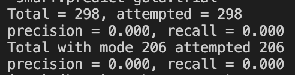
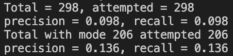
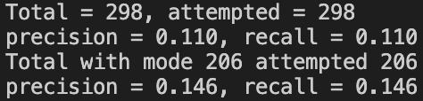
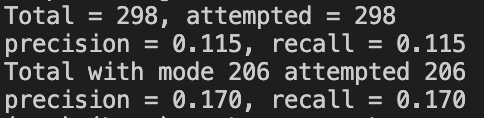
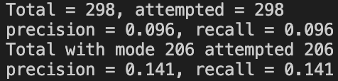

# A Lexical Substitution Task

## Introduction

**Background for Project:**

This project was completed for my NLP class (Professor Bauer) at Columbia University.

**Task:** In this project, I use WordNet, pre-trained Word2Vec embeddings, and BERT to find lexical substitutes for individual target words given a particular context. This is useful for tasks such as question answering, summarization, paraphrase acquisition, text simplification, etc.

For example, given the following sentence:

"Anyway , my pants are getting **tighter** every day ." 

the goal is to propose an alternative word for **tight**, such that the meaning of the sentence is preserved. Such a substitute could be *constricting*, *small* or *uncomfortable*.

In the sentence

"If your money is **tight** don't cut corners ." 

the substitute *small* would not fit, and instead possible substitutes include *scarce*, *sparse*, *limitited*, *constricted*.

## Setup

1. python3 -m venv env
2. source env/bin/activate
3. pip install nltk
4. $python
5. >>>import nltk
6. >>>nltk.download() (select wordnet and stopwords packages from the corpora tab)
7. >>>from nltk.corpus import wordnet as wn
4. pip install --upgrade gensim
5. pip install transformers
6. pip install tensorflow

## Libraries & Packages

1. **NLTK**- The standard way to access WordNet in Python is now NLTK, the Natural Language Toolkit. NLTK contains a number of useful resources, such as POS taggers and parsers, as well as access to several text corpora and other data sets. In this project, we mostly use its WordNet interface.
2. **WordNet**- a lexical database of semantic relations between words that links words into semantic relations including synonyms, hyponyms, and meronyms.
2. **Gensim**- Gensim is a vector space modeling package for Python. While gensim includes a complete implementation of word2vec (among other approaches), we will use it only to load existing word embeddings. We can also use it for obtaining vector representations of individual words and computing the cosine similarity between two word vectors.
4. **Pre-trained Word Embeddings:** The embeddings were provided by the professor. They were trained using a modified skip-gram architecture on 100B words of Google News text, with a context window of +-5. The word embeddings have 300 dimensions.
3. **Huggingface Transformers**- We will use the BERT implementation by Huggingface, or more specifically their slightly more compact model **DistilBERT**. In this project, we don't train the BERT model ourselves but experiment with the pre-trained masked language model to find substitutes. 
4. **word2vec:** used to create a distributed representation of words into numerical vectors. Word2vec converts text into vectors that capture semantics and relationships among words. Algorithms include skip-gram and CBOW.

## Terminology

- **lemma:** A lemma is the base form of a word, typically the form found in a dictionary. The lemma of the word "running" is "run."
- **lexeme:** A lexeme is a unit of language that represents a set of words with similar meaning and grammatical properties. Lexemes encompass all the inflected forms (variations) of a word. For example, the lexeme "run" includes "runs," "ran," "running," etc.
- **synset:** (synonym set)- a group of words or expressions in a natural language that have the same or very similar meanings. Synsets are often used in the context of lexical semantics and in resources like WordNet to group words with related meanings.
- **hypernym:** a word or concept that represents a broader or more general category, under which one or more specific words or concepts (hyponyms) fall. For example, "fruit" is a hypernym for "apple" and "banana."
- **hyponym:** a word or concept that represents a more specific or specialized category within a broader category, often called a hypernym. In the example above, "apple" and "banana" are hyponyms of the hypernym "fruit."

## Pre-trained Word2Vec Embeddings

These embeddings were trained using a modified skip-gram architecture on 100B words of Google News text, with a context window of +-5. The word embeddings have 300 dimensions. We will not train a BERT model ourselves, but we will experiment with the pre-trained masked language model to find substitutes. 

## Files

- **lexsub_trial.xml** - input trial data containing 300 sentences with a single target word each.
- **gold.trial** - gold annotations for the trial data (substitues for each word suggested by 5 judges).
- **lexsub_xml.py** - an XML parser that reads lexsub_trial.xml into Python objects.
- **lexsub_main.py** - this is the main scaffolding code where I complete my code. The main section of that file loads the XML file, calls a predictor method on each context, and then print output suitable for the SemEval scoring script. The purpose of the predictor methods is to select an appropriate lexical substitute for the word in context.
- **score.pl** - the scoring script provided for the SemEval 2007 lexical substitution task.

### Starting Point

`python lexsub_main.py lexsub_trial.xml > smurf.predict
perl score.pl smurf.predict gold.trial`

Default method: substitute the word 'smurf' for all target words.

### Part 1: Candidate Synonyms from WordNet: get_candidates(lemma.pos)

**Task:** look up the lemma and part of speech in WordNet and retrieve all synsets that the lemma appears in

`get_candidates('slow','a')
{'deadening', 'tiresome', 'sluggish', 'dense', 'tedious', 'irksome', 'boring', 'wearisome', 'obtuse', 'dim', 'dumb', 'dull', 'ho-hum'}`

### Part 2: WordNet Frequency Baseline

**wn_frequency_predictor(context):** takes a context object as input and predicts the possible synonym with the highest total occurence frequency (according to WordNet).

`python lexsub_main.py lexsub_trial.xml > 2.predict
perl score.pl 2.predict gold.trial`

### Part 3: WordNet Frequency Baseline

**wn_simple_lesk_predictor(context):** This function uses Word Sense Disambiguation (WSD) to select a synset for the target word. It should returns the most frequent synonym from that synset as a substitute.

The primary goal of **word sense disambiguation** is to assign the appropriate sense or meaning to a word within a given sentence or text, ensuring that the chosen sense is contextually relevant. 

To perform WSD, we implement the **simple Lesk algorithm**. We look at all possible synsets that the target word apperas in and compute the overlap between the definition of the synset and the context of the target word.

The main *problem* with the Lesk algorithm is that the definition and the context do not provide enough text to get any overlap in most cases. We should therefore add the following to the definition:

- All examples for the synset.
- The definition and all examples for all hypernyms of the synset.

`python lexsub_main.py lexsub_trial.xml > 3.predict
perl score.pl 3.predict gold.trial`

### Part 4: Most Similar Synonym (Word2Vec)

**predict_nearest(context):** obtains a set of possible synonyms from WordNet and then return the synonym that is most similar to the target word, according to the Word2Vec embeddings. 

`python lexsub_main.py lexsub_trial.xml > 4.predict
perl score.pl 4.predict gold.trial`

### Part 5: Using BERT's masked language model 

BERT is trained on a masked language model objective, that is, given some input sentence with some words replaced with a [MASK] symbol, the model tries to predict the best words to fit the masked positions. In this way, BERT can make use of both the left and right context to learn word representations (unlike ELMo and GPT).

The basic idea is that we can feed the context sentence into BERT and it will tell us "good" replacements for the target word. The output will be a vector of length |V| for each word, containing a score for each possible output word. There are two possible approaches: We can either leave the target word in the input, or replace it with the [MASK] symbol.

We can use BERT to rank the WordNet derived candidates. We combine WordNet's ability to produce a concise set of synonyms (although for all possible senses of the target word), with BERT's ability to take the sentence context into account and select a substitute.

**predict(context):** 

- Obtain a set of candidate synonyms
- Convert the information in context into a suitable masked input representation for the DistilBERT model. Store the index of the masked target word (the position of the [MASK] token).
- Run the DistilBERT model on the input representation.
- Check overlap between candidates from Word2Vec and Bert. No overlap, then return the first word from BERT.
- Select, from the set of wordnet derived candidate synonyms, the highest-scoring word in the target position (i.e. the position of the masked word). Return this word.

`python lexsub_main.py lexsub_trial.xml > 5.predict
perl score.pl 5.predict gold.trial`

### Part 6

`python lexsub_main.py lexsub_trial.xml > 6.predict
perl score.pl 6.predict gold.trial`